  <picture>
    <source media="(prefers-color-scheme: light)" srcset="assets/hero-light.svg" />
    <source media="(prefers-color-scheme: dark)" srcset="assets/hero.svg" />
    
  </picture>

<strong>~/about</strong>

I lead applied AI work at [ISx4](https://isx4.com), building production-oriented ML, LLM, agentic, and computer vision systems. My work sits between research depth and engineering delivery: turning ambiguous AI opportunities into reliable systems with evaluation, observability, security, and workflow fit built in from the start.

<strong>~/selected-ai-systems</strong>

A few representative systems where the signal is in the delivery shape: translating ambiguous AI opportunities into systems teams can evaluate, operate, and improve. Some are private, internal, or client-facing, so I focus on the engineering pattern rather than repository links.

- **RunAI for GAA**
  Applied AI for sports and organisational workflows, from product discovery through deployment-aware ML delivery.  
  `workflow modelling` &#183; `applied ML` &#183; `product discovery` &#183; `operational fit`

- **ISx4 ASQ -- Internal AI Assistant**
  Enterprise assistant for ISx4 with governance, knowledge access, evaluation, and client-readiness built into the workflow.  
  `LLM systems` &#183; `enterprise knowledge access` &#183; `governance` &#183; `evaluation`

- **AOP -- Agent Observability Platform**
  Platform work for observing, evaluating, and improving AI agent behaviour in production-like environments.  
  `tracing` &#183; `failure analysis` &#183; `feedback loops` &#183; `agent operations`

- **Customer Handling AI for Aviation Client**
  Enterprise AI for aviation customer-handling workflows where safety awareness, reliability, and operational constraints matter.  
  `workflow automation` &#183; `customer intelligence` &#183; `reliability` &#183; `operational constraints`

Together, these projects reflect the work I enjoy most: moving from unclear AI opportunity to reliable system, with evaluation, monitoring, and workflow fit built in early.

<strong>~/engineering-profile</strong>

How I tend to create value: by moving between research, systems thinking, product judgement, and production engineering without treating them as separate worlds.

- **Shape the AI opportunity**
  Turn ambiguous ideas into scoped systems, delivery plans, evaluation criteria, and practical technical direction.  
  `discovery` &#183; `architecture` &#183; `technical leadership`

- **Build LLM and agentic systems**
  Design assistants, retrieval workflows, tool-using agents, governance paths, and feedback loops that teams can trust.  
  `RAG` &#183; `agents` &#183; `evaluation` &#183; `governance`

- **Translate ML and computer vision research**
  Bring statistical ML, deep learning, gaze/intention inference, and visual modelling into usable decision-support systems.  
  `computer vision` &#183; `representation learning` &#183; `human signals`

- **Ship production-ready AI**
  Build APIs, data pipelines, containers, monitoring, observability, and deployment paths that can survive real workflows.  
  `MLOps` &#183; `observability` &#183; `cloud` &#183; `reliability`

<strong>~/stack</strong>

  <picture>
    <source media="(prefers-color-scheme: light)" srcset="assets/stack-light.svg" />
    <source media="(prefers-color-scheme: dark)" srcset="assets/stack.svg" />
    
  </picture>

<strong>~/career-landmarks</strong>

A few professional landmarks behind the systems work. CV available on request.

  <picture>
    <source media="(prefers-color-scheme: light)" srcset="assets/experience-light.svg" />
    <source media="(prefers-color-scheme: dark)" srcset="assets/experience.svg" />
    
  </picture>

<strong>~/research-background</strong>

My research background sits behind the engineering: computer vision, dyadic interaction, gaze and visual cue modelling, human intention inference, and reliable ML. I use that depth to build AI systems that can handle noisy data, deployment constraints, and evaluation pressure.

I am also a Visiting Fellow at Queen's University Belfast, where my work connects machine learning, human-robot collaboration, and reliable visual inference.

**Dyadic interaction, HRI, and intention inference**

- **[Deep learning of dyadic interaction visual cues for human-robot collaboration in assembly tasks](https://pure.qub.ac.uk/en/studentTheses/deep-learning-of-dyadic-interaction-visual-cues-for-human-robot-c/)**  
  PhD thesis, Queen's University Belfast, 2024. Dyadic interaction, visual cues, gaze estimation, task recognition, action recognition, and intention-aware human-robot collaboration.

- **[QUB-PHEO: A Visual-Based Dyadic Multi-View Dataset for Intention Inference in Collaborative Assembly](https://doi.org/10.1109/ACCESS.2024.3485162)**  
  IEEE Access, 2024. Multi-view dyadic interaction dataset for intention inference in collaborative assembly.  
  [Dataset](https://github.com/exponentialR/QUB-PHEO) &#183; [arXiv](https://arxiv.org/abs/2409.15560)

- **[Hand-Eye-Object Tracking for Human Intention Inference](https://doi.org/10.1016/j.ifacol.2022.07.627)**  
  IFAC-PapersOnLine, 2022. Intention inference from hand movement, eye fixation, and object interaction cues.

- **[Dyadic Human-Robot Interaction: Emerging Technologies, Challenges, and Opportunities](https://doi.org/10.1007/978-981-96-9471-6_1)**  
  Book chapter, 2025. A broader treatment of dyadic HRI, emerging technologies, and open challenges.

- **[Establishing Baselines for Dyadic Visual Motion Prediction Using the QUB-PHEO Dataset](https://doi.org/10.1016/j.ifacol.2025.12.064)**  
  IFAC-PapersOnLine, 2025. Reproducible baselines for motion prediction on QUB-PHEO.

**Applied computer vision and reliable ML**

- **[SLYKLatent: A Learning Framework for Gaze Estimation Using Deep Facial Feature Learning](https://doi.org/10.1109/THMS.2025.3553404)**  
  IEEE Transactions on Human-Machine Systems, 2025. Gaze estimation and facial feature representation learning.  
  [arXiv](https://arxiv.org/abs/2402.01555)

- **[AlzhiNet: Traversing from 2D-CNN to 3D-CNN, Towards Early Detection and Diagnosis of Alzheimer's Disease](https://doi.org/10.1007/s12539-025-00764-w)**  
  Interdisciplinary Sciences: Computational Life Sciences, 2026. Hybrid 2D/3D CNN representations for Alzheimer's disease diagnosis.  
  [arXiv](https://arxiv.org/abs/2410.02714)

- **[ConPose: A Jointly Trained, Single-Pass RGB Detection-and-Pose Framework for Intermeshed Steel Connections](https://doi.org/10.1007/s00138-026-01863-4)**  
  Machine Vision and Applications, 2026. Joint detection and 6-DoF pose estimation for intermeshed steel connections using RGB-only, single-pass inference.

- **[ISC-Perception: A Hybrid Computer Vision Dataset for Object Detection in Novel Steel Assembly](https://arxiv.org/abs/2511.03098)**  
  arXiv, 2025. Hybrid synthetic and real-world perception dataset for intermeshed steel connection assembly.

- **[A Proposed Strategy for Automating Intermeshed Steel Connection Assembly using Robotics](https://doi.org/10.22260/ISARC2025/0063)**  
  ISARC, 2025. Robotic assembly strategy for intermeshed steel connections.

- **[Application of Deep Learning to Autonomous Robotic Car](https://ijcaonline.org/archives/volume183/number13/31985-2021921421/)**  
  International Journal of Computer Applications, 2021. Computer vision for autonomous robotic-car perception.

**Datasets, tools, and reproducible research artifacts**

- **[QUB-Perception of Human Engagement in Assembly Operation Dataset](https://doi.org/10.5281/zenodo.13956074)**  
  Zenodo dataset release for PHEO/QUB-PHEO research.

- **[Preprocessing Repository of QUB-Perception of Human Engagement in Assembly Operations Dataset](https://doi.org/10.5281/zenodo.13956098)**  
  Reproducible preprocessing artifact supporting the QUB-PHEO dataset.

- **[QUBVidCalib: Video Calibration and Correction Toolbox](https://github.com/exponentialR/qubvidcalib)**  
  Calibration and correction tooling for multi-view video workflows.

- **[aVerify: A Video Annotation Verification Tool](https://github.com/exponentialR/averify)**  
  Tooling for validating and checking video annotation quality.

- **[Ormedian-Utils: A Computer Vision Utilities Package](https://github.com/exponentialR/ormedian-utils/)**  
  Utility package for computer vision workflows.

**Technical notes**

- **[Camera Calibration Demystified: Part 2 - Applications and Lens Distortion](https://samueladebayo.com/camera-calibration-demystified-part-2-applications-and-lens-distortion)**  
  Practical camera calibration notes for robotics, autonomous systems, and lens distortion.

- **[Understanding Principal Component Analysis (PCA): A Comprehensive Guide](https://samueladebayo.com/understanding-principal-component-analysis-pca-a-comprehensive-guide)**  
  Mathematical and code-oriented guide to PCA, dimensionality reduction, and practical ML use cases.

For the full publication list, see my [Google Scholar](https://scholar.google.com/citations?user=spfLwBEAAAAJ&hl=en).

<strong>~/current-interests</strong>

- Enterprise AI agents with evaluation, observability, and clear operating boundaries
- LLM application quality: testing, monitoring, retrieval, and feedback loops
- Computer vision in high-stakes settings
- Production ML architecture across data, model, service, and user workflows
- Data-centric AI practices that turn usage and feedback into better systems

<strong>~/contact</strong>

Open to conversations around **AI Engineering**, **Applied AI Leadership**, **ML Engineering**, **Principal Data Scientist**, **Principal AI Engineer**, and **Applied Research** roles where research depth and production delivery both matter.

  
  
  
  
  

